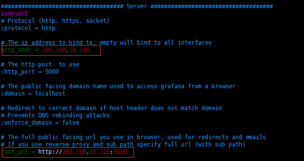
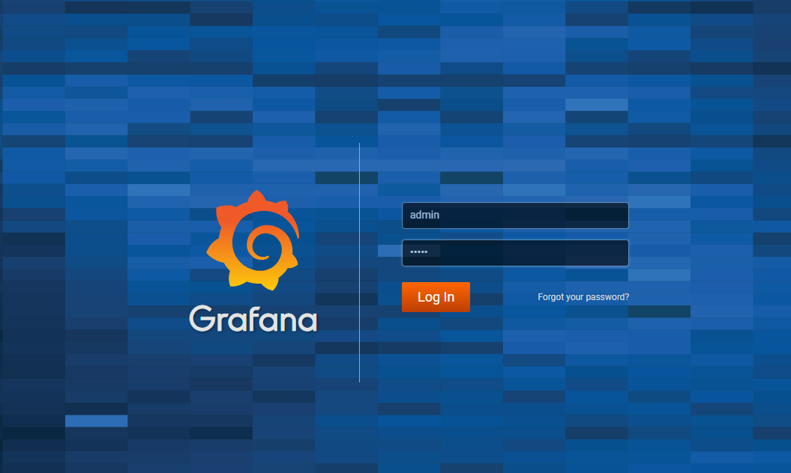
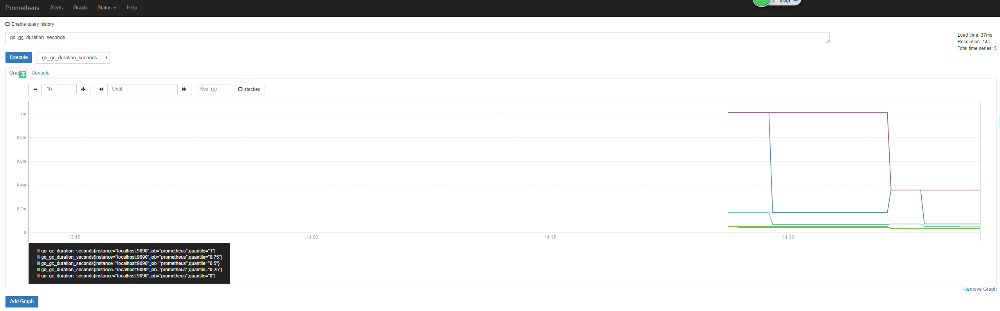

# Prometheus + Grafana 搭建可视化监控系统

## 一.Grafana

### 1.安装

Ubantu:

````shell
curl https://raw.githubusercontent.com/stulzq/MonitoringSystem/master/grafana/install-ubantu-5.3.0-x86-64|sh
````

其他系统：http://docs.grafana.org/installation/

## 2.操作

````shell
systemctl start grafana-server #启动服务
systemctl stop grafana-server #停止服务
systemctl restart grafana-server #重启服务
systemctl status grafana-server #查看服务
````

### 3.配置

编辑配置文件

````shell
vim /etc/grafana/grafana.ini
````

修改 监听地址为你需要的，默认为 `localhost`



重启服务：

````shell
systemctl restart grafana-server
````

### 4.访问

输入你配置的地址访问，默认登录用户名密码都是 `admin`



## 二.Prometheus

### 1.安装

使用 root 用户，或者具有 root 权限的用户执行以下命令：

````shell
curl https://raw.githubusercontent.com/stulzq/MonitoringSystem/master/prometheus/install-2.4.3-linux-amd64|sh
````

官方：https://prometheus.io/download/

### 2.访问

在浏览器输入 `http://<ip>:9090` 即可访问。默认有一个监控自己的 job



### 3.操作

````shell
systemctl start promoetheus #启动服务
systemctl stop promoetheus #停止服务
systemctl restart promoetheus #重启服务
systemctl status promoetheus #查看服务
````

